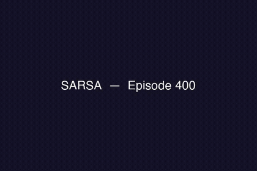
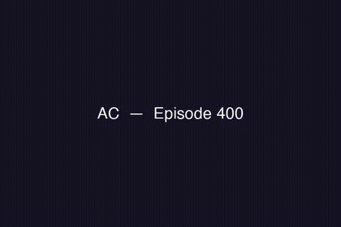
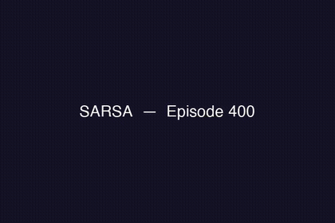
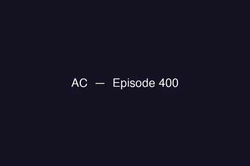
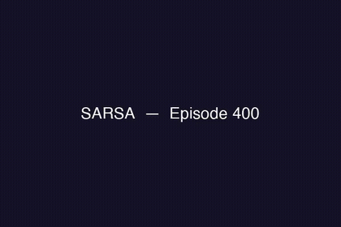
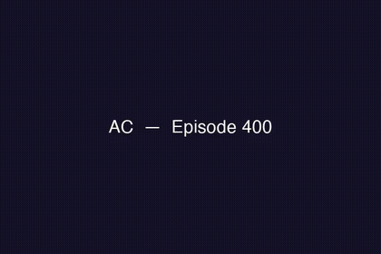
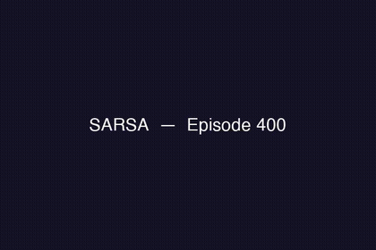
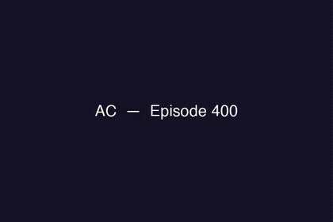
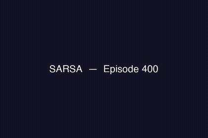
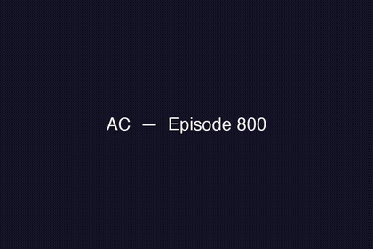

# Deep SARSA vs Advantage Actor-Critic on LunarLander-v3

**SEAI Project — Francesco Galardi, Andrea Vagnoli**  
*Symbolic and Evolutionary Artificial Intelligence — University of Pisa, 2026*

## Project Summary

Standard RL Project (SRLP) comparing two fundamentally different RL paradigms:

| Algorithm | Type | Exploration | Training |
|-----------|------|-------------|----------|
| **Deep SARSA** | On-policy, value-based (TD) | ε-greedy | 3 000 episodes, 1 env |
| **A2C (Actor-Critic)** | On-policy, policy-gradient | Entropy regularisation | 5 000 episodes, 8 parallel envs |

Environment: `LunarLander-v3` (Gymnasium) + 3 custom variants for generalisation tests.

### Key results (5 seeds, best checkpoint, 100 eval episodes)

| Variant | Deep SARSA | A2C | Winner |
|---------|-----------|-----|--------|
| Standard | **202.8 ± 22.2** | 180.0 ± 39.3 | SARSA ✓ (solved) |
| Wind | 112.3 ± 39.1 | **136.3 ± 51.6** | A2C |
| Turbulent | 47.2 ± 36.8 | **126.1 ± 32.0** | A2C |
| Heavy gravity | 145.8 ± 22.7 | **167.9 ± 46.1** | A2C |

Welch's t-test on training finals: p = 0.039 (SARSA > A2C, significant at α = 0.05).

---

## Repository Structure

```
project/
├── media/                            # README preview assets (GIFs + sample MP4s)
├── config/
│   ├── sarsa_config.yaml            # SARSA hyperparameters + ablation flags
│   └── actor_critic_config.yaml     # A2C hyperparameters + ablation flags
├── src/
│   ├── environment/
│   │   ├── lunar_lander_wrapper.py  # Wrapper, variants, VecRunningNormalizer
│   │   └── custom_reward.py         # CustomLunarLander with configurable coefficients
│   ├── networks/
│   │   ├── sarsa_network.py         # Q-network (MLP)
│   │   └── actor_critic_network.py  # Actor + Critic networks
│   ├── agents/
│   │   ├── deep_sarsa.py            # Deep SARSA (replay buffer / online / parallel)
│   │   └── actor_critic.py          # A2C (single env + vectorised)
│   └── utils/
│       ├── replay_buffer.py         # Experience replay buffer
│       ├── logger.py                # CSV logger + run_info.json
│       └── metrics.py               # Statistics + plots
├── models/                          # Saved checkpoints (.pt)
│   └── {tag}{agent}_seed{seed}_{best|ep*}.pt
├── results/
│   ├── logs/                        # Per-run training logs
│   │   └── {tag}{agent}_seed{seed}/
│   │       ├── training_log.csv
│   │       └── run_info.json        # Proof of completed run
│   ├── videos/                      # Recorded episodes
│   │   └── {agent}/{variant}/
│   └── evaluation_*.json            # Aggregate evaluation results
├── train.py                         # Multi-seed training + grid search
├── evaluate.py                      # Single-seed evaluation on all variants
├── evaluate_all.py                  # Aggregate evaluation across all seeds
├── compare.py                       # Learning curves + Welch's t-test
├── record_video.py                  # Record episodes from a checkpoint
├── make_progress_video.py           # Stitch per-checkpoint frames into one video
└── requirements.txt
```

---

## Quickstart

```bash
pip install -r requirements.txt
```

### Training

```bash
# Train both agents — all 5 seeds:
python train.py --device cpu

# Train a single agent:
python train.py --agent sarsa --device cpu
python train.py --agent ac    --device cpu

# Quick smoke-test (1 seed, 100 episodes):
python train.py --agent sarsa --episodes 100 --seeds 42 --device cpu
```

### Grid Search

```bash
# SARSA — search learning rate × epsilon decay:
python train.py --agent sarsa --seeds 42 --device cpu \
    --grid alpha=0.0003,0.0005 epsilon_decay=0.995,0.997

# A2C — search entropy coefficient:
python train.py --agent ac --seeds 42 --device cpu \
    --grid entropy_coef=0.001,0.003,0.005,0.01
```

Results are printed ranked and saved to `results/grid_{agent}_{timestamp}.json`.

### Evaluation

```bash
# Single seed — evaluate best checkpoint on all variants:
python evaluate.py --agent sarsa --seed 42 --ckpt_type best --device cpu
python evaluate.py --agent ac    --seed 42 --ckpt_type best --device cpu

# All seeds — aggregate evaluation (mean ± std across 5 seeds):
python evaluate_all.py --n_eval 100 --ckpt_type best --device cpu
```

### Analysis

```bash
# Learning curves + Welch's t-test on training finals:
python compare.py
```

### Videos

Progress videos (standard variant, seed 42) stitching every periodic checkpoint into a single clip — landing behaviour visibly improves episode by episode:

<table>
<tr>
<th>Deep SARSA</th>
<th>A2C</th>
</tr>
<tr>
<td></td>
<td></td>
</tr>
<tr>
<td><a href="media/sarsa_standard_seed42.mp4">Full MP4</a></td>
<td><a href="media/ac_standard_seed42.mp4">Full MP4</a></td>
</tr>
</table>

All other progress videos (environment variants, ablations) are available as MP4 files in [`media/`](media/) — browse the folder directly to watch them.

Reproduce these or record any other agent/variant/ablation combination:

```bash
# Record 3 episodes from the best checkpoint of each variant:
python record_video.py --agent sarsa --seed 42 --ckpt_type best
python record_video.py --agent ac    --seed 42 --ckpt_type best

# Progress video — stitch all periodic checkpoints into one MP4:
python make_progress_video.py --agent sarsa --seed 42
python make_progress_video.py --agent ac    --seed 42
```

---

## Hyperparameters

Both agents use **cosine annealing** LR scheduling and **best-checkpoint saving** (rolling mean of last 100 episodes). Final hyperparameters were selected via grid search.

| Parameter | Deep SARSA | A2C |
|-----------|-----------|-----|
| LR (start → end) | 5×10⁻⁴ → 5×10⁻⁵ | actor 3×10⁻⁴ → 10⁻⁵ / critic 10⁻⁴ → 10⁻⁵ |
| γ | 0.99 | 0.99 |
| ε decay | 0.995 (→ 0.01 at ep ~920) | — |
| Entropy coef β | — | 0.003 |
| n-step horizon | — | 200 |
| Parallel envs | 1 | 8 (SyncVectorEnv) |
| Batch size | 128 | — |
| Buffer | 50 000 | — |
| Episodes | 3 000 | 5 000 |
| Seeds | 42, 123, 456, 789, 1234 | 42, 123, 456, 789, 1234 |

---

## Ablation Studies

All ablations share the same CLI as standard training. The `--tag` flag prefixes checkpoint and log filenames so ablation runs never overwrite the baseline.

Checkpoints are saved as `models/{tag}{agent}_seed{seed}_best.pt`.  
Logs are saved to `results/logs/{tag}{agent}_seed{seed}/run_info.json`.

### CLI Flag Reference

| Flag | Agent | Description |
|------|-------|-------------|
| `--no_replay_buffer` | SARSA | Disable the replay buffer (online TD updates) |
| `--parallel_envs N` | SARSA | N parallel envs, implies no replay buffer |
| `--n_steps N` | A2C | Override `n_step_horizon` |
| `--num_envs N` | A2C | Override number of parallel environments |
| `--reward_coef K=V` | both | Override a single reward coefficient (repeatable) |
| `--entropy_coef V` | A2C | Override entropy regularisation coefficient (e.g. `0` to disable) |
| `--tag PREFIX` | both | Prefix for checkpoint and log filenames |

---

### 1 · Deep SARSA — With vs Without Replay Buffer

The replay buffer breaks temporal correlations between consecutive transitions. Disabling it means the network trains on one correlated transition at a time.

**Baseline (with buffer)** — default behaviour, no extra flags:
```bash
python train.py --agent sarsa --device cpu \
    --seeds 42 123 456 789 1234 --episodes 3000
```

**Without replay buffer** (online TD):
```bash
python train.py --agent sarsa --device cpu \
    --seeds 42 123 456 789 1234 --episodes 3000 \
    --no_replay_buffer --tag noreplay_
```

**Evaluate:**
```bash
# Baseline
python evaluate_all.py --agents sarsa --n_eval 100

# No-buffer ablation
python evaluate_all.py --agents sarsa --n_eval 100 --tag noreplay_
```

---

### 2 · Deep SARSA — Parallel Environments (no buffer)

Decorrelation via environment diversity instead of a replay buffer.  
`--parallel_envs N` automatically implies `--no_replay_buffer`.

```bash
# 4 parallel envs
python train.py --agent sarsa --device cpu \
    --seeds 42 123 456 789 1234 --episodes 3000 \
    --parallel_envs 4 --tag parallel4_

# 8 parallel envs
python train.py --agent sarsa --device cpu \
    --seeds 42 123 456 789 1234 --episodes 3000 \
    --parallel_envs 8 --tag parallel8_
```

**Evaluate:**
```bash
python evaluate_all.py --agents sarsa --n_eval 100 --tag parallel4_
python evaluate_all.py --agents sarsa --n_eval 100 --tag parallel8_
```

Three-way comparison: baseline (buffer) · no buffer (1 env) · no buffer (N envs).

---

### 3 · A2C — n_steps Sweep

`n_steps` controls the bias–variance trade-off of the return estimate:
- small values → TD-like (high bias, low variance)
- large values → near-Monte Carlo (low bias, high variance)

```bash
# n_steps = 5
python train.py --agent ac --device cpu \
    --seeds 42 123 456 789 1234 \
    --n_steps 5 --tag nstep5_

# n_steps = 20
python train.py --agent ac --device cpu \
    --seeds 42 123 456 789 1234 \
    --n_steps 20 --tag nstep20_

# n_steps = 50
python train.py --agent ac --device cpu \
    --seeds 42 123 456 789 1234 \
    --n_steps 50 --tag nstep50_

# n_steps = 200 — baseline (default)
python train.py --agent ac --device cpu \
    --seeds 42 123 456 789 1234
```

**Evaluate:**
```bash
python evaluate_all.py --agents ac --n_eval 100 --tag nstep5_
python evaluate_all.py --agents ac --n_eval 100 --tag nstep20_
python evaluate_all.py --agents ac --n_eval 100 --tag nstep50_
python evaluate_all.py --agents ac --n_eval 100              # baseline
```

---

### 4 · A2C — num_envs Sweep (fixed n_steps)

Fix `n_steps` at a short horizon and vary the number of parallel environments to study whether environment diversity compensates for the shorter return window.

```bash
# 1 env, n_steps 20
python train.py --agent ac --device cpu \
    --seeds 42 123 456 789 1234 \
    --n_steps 20 --num_envs 1 --tag e1s20_

# 4 envs, n_steps 20
python train.py --agent ac --device cpu \
    --seeds 42 123 456 789 1234 \
    --n_steps 20 --num_envs 4 --tag e4s20_

# 8 envs, n_steps 20
python train.py --agent ac --device cpu \
    --seeds 42 123 456 789 1234 \
    --n_steps 20 --num_envs 8 --tag e8s20_

# 16 envs, n_steps 20
python train.py --agent ac --device cpu \
    --seeds 42 123 456 789 1234 \
    --n_steps 20 --num_envs 16 --tag e16s20_
```

**Evaluate:**
```bash
python evaluate_all.py --agents ac --n_eval 100 --tag e1s20_
python evaluate_all.py --agents ac --n_eval 100 --tag e4s20_
python evaluate_all.py --agents ac --n_eval 100 --tag e8s20_
python evaluate_all.py --agents ac --n_eval 100 --tag e16s20_
```

---

### 5 · Reward Coefficient Ablation

`CustomLunarLander` replicates the standard Gymnasium reward function but with configurable coefficients. The default coefficients reproduce the original environment exactly.

**Gymnasium reward formula:**
```
shaping  = -100·dist - 100·speed - 100·|angle| + 10·(leg_L + leg_R)
r        = Δshaping - 0.30·m_power - 0.03·s_power
terminal = ±100  (crash / land)
```

**Available coefficient keys:**

| Key | Default | Controls |
|-----|---------|----------|
| `pos_coef` | 100 | Distance-to-pad penalty |
| `vel_coef` | 100 | Speed penalty |
| `angle_coef` | 100 | Tilt penalty |
| `leg_reward` | 10 | Leg-contact bonus |
| `main_engine_coef` | 0.30 | Main engine fuel cost |
| `side_engine_coef` | 0.03 | Side engine fuel cost |
| `crash_penalty` | 100 | Terminal crash penalty |
| `land_bonus` | 100 | Terminal landing bonus |

**Four variants actually run for this project** (both agents, 5 seeds each):

| Tag | Rationale | Overridden coefficients |
|-----|-----------|--------------------------|
| `rc_precise_` | Penalise imprecise landings more | `vel_coef=200 angle_coef=200` |
| `rc_fuel_` | Penalise fuel use more (efficiency) | `main_engine_coef=1.0 side_engine_coef=0.3` |
| `rc_terminal_` | Amplify the terminal crash/landing signal | `crash_penalty=300 land_bonus=300` |
| `rc_lazy_` | Weaken shaping (sparser feedback) | `vel_coef=10 angle_coef=10 leg_reward=1` |

**Training (all 5 seeds, both agents):**
```bash
# rc_precise — double speed/angle penalty
python train.py --agent sarsa --device cpu \
    --seeds 42 123 456 789 1234 --episodes 3000 \
    --reward_coef vel_coef=200 angle_coef=200 --tag rc_precise_
python train.py --agent ac --device cpu \
    --seeds 42 123 456 789 1234 \
    --reward_coef vel_coef=200 angle_coef=200 --tag rc_precise_

# rc_fuel — more expensive engines
python train.py --agent sarsa --device cpu \
    --seeds 42 123 456 789 1234 --episodes 3000 \
    --reward_coef main_engine_coef=1.0 side_engine_coef=0.3 --tag rc_fuel_
python train.py --agent ac --device cpu \
    --seeds 42 123 456 789 1234 \
    --reward_coef main_engine_coef=1.0 side_engine_coef=0.3 --tag rc_fuel_

# rc_terminal — stronger crash/landing signal
python train.py --agent sarsa --device cpu \
    --seeds 42 123 456 789 1234 --episodes 3000 \
    --reward_coef crash_penalty=300 land_bonus=300 --tag rc_terminal_
python train.py --agent ac --device cpu \
    --seeds 42 123 456 789 1234 \
    --reward_coef crash_penalty=300 land_bonus=300 --tag rc_terminal_

# rc_lazy — weaker shaping (less precision feedback)
python train.py --agent sarsa --device cpu \
    --seeds 42 123 456 789 1234 --episodes 3000 \
    --reward_coef vel_coef=10 angle_coef=10 leg_reward=1 --tag rc_lazy_
python train.py --agent ac --device cpu \
    --seeds 42 123 456 789 1234 \
    --reward_coef vel_coef=10 angle_coef=10 leg_reward=1 --tag rc_lazy_
```

Alternatively, set `reward_coefficients.enabled: true` and edit the values directly in `config/sarsa_config.yaml` or `config/actor_critic_config.yaml`.

**Evaluate (both agents, all seeds):**
```bash
python evaluate_all.py --tag rc_precise_  --agents sarsa ac --n_eval 100
python evaluate_all.py --tag rc_fuel_     --agents sarsa ac --n_eval 100
python evaluate_all.py --tag rc_terminal_ --agents sarsa ac --n_eval 100
python evaluate_all.py --tag rc_lazy_     --agents sarsa ac --n_eval 100
```

**Progress video (seed 42, both agents):**
```bash
python make_progress_video.py --agent sarsa --seed 42 --tag rc_precise_  --step 400
python make_progress_video.py --agent ac    --seed 42 --tag rc_precise_  --step 400
python make_progress_video.py --agent sarsa --seed 42 --tag rc_fuel_     --step 400
python make_progress_video.py --agent ac    --seed 42 --tag rc_fuel_     --step 400
python make_progress_video.py --agent sarsa --seed 42 --tag rc_terminal_ --step 400
python make_progress_video.py --agent ac    --seed 42 --tag rc_terminal_ --step 400
python make_progress_video.py --agent sarsa --seed 42 --tag rc_lazy_     --step 400
python make_progress_video.py --agent ac    --seed 42 --tag rc_lazy_     --step 400
```

**Previews** (progress video per tag, seed 42 — click a GIF for the full MP4):

<table>
<tr><th></th><th>Deep SARSA</th><th>A2C</th></tr>
<tr>
<td><code>rc_precise_</code></td>
<td><a href="media/rc_precise_sarsa_standard_seed42.mp4"></a></td>
<td><a href="media/rc_precise_ac_standard_seed42.mp4"></a></td>
</tr>
<tr>
<td><code>rc_fuel_</code></td>
<td><a href="media/rc_fuel_sarsa_standard_seed42.mp4"></a></td>
<td><a href="media/rc_fuel_ac_standard_seed42.mp4"></a></td>
</tr>
<tr>
<td><code>rc_terminal_</code></td>
<td><a href="media/rc_terminal_sarsa_standard_seed42.mp4"></a></td>
<td><a href="media/rc_terminal_ac_standard_seed42.mp4"></a></td>
</tr>
<tr>
<td><code>rc_lazy_</code></td>
<td><a href="media/rc_lazy_sarsa_standard_seed42.mp4"></a></td>
<td><a href="media/rc_lazy_ac_standard_seed42.mp4"></a></td>
</tr>
</table>

---

### 6 · A2C — Entropy Regularisation Ablation

Entropy regularisation adds a bonus proportional to the action-distribution entropy, encouraging exploration and discouraging premature policy collapse. This ablation disables it entirely (`entropy_coef=0`, baseline is `0.003`) to test how much it actually contributes to final performance.

**Single-seed smoke test:**
```bash
python train.py --agent ac --device cpu \
    --seeds 42 --entropy_coef 0 --tag noentropy_
```

**All 5 seeds:**
```bash
python train.py --agent ac --device cpu \
    --seeds 42 123 456 789 1234 \
    --entropy_coef 0 --tag noentropy_
```

**Evaluate:**
```bash
python evaluate_all.py --tag noentropy_ --agents ac --n_eval 100
```

**Progress video:**
```bash
python make_progress_video.py --agent ac --seed 42 --tag noentropy_
```

---

### Evaluation Output

Each `evaluate_all.py` run saves a JSON to `results/`:

```
results/evaluation_{tag}_{ckpt_type}_{timestamp}.json
```

The JSON contains per-seed and aggregated (mean ± std) results for all 4 environment variants, ready for statistical analysis.

```bash
# Baseline (no tag)
python evaluate_all.py --n_eval 100
# → results/evaluation_baseline_best_YYYYMMDD_HHMMSS.json

# Ablation
python evaluate_all.py --tag noreplay_ --agents sarsa --n_eval 100
# → results/evaluation_noreplay_best_YYYYMMDD_HHMMSS.json
```

---

## Referenced Repositories

- Deep SARSA base: [JohDonald/Deep-Q-Learning-Deep-SARSA-LunarLander-v3](https://github.com/JohDonald/Deep-Q-Learning-Deep-SARSA-LunarLander-v3)
- Actor-Critic base: [nikhilbarhate99/Actor-Critic-PyTorch](https://github.com/nikhilbarhate99/Actor-Critic-PyTorch)

Both were significantly extended with: unified training framework, custom environment wrapper with observation normalisation, vectorised environments (A2C), cosine annealing LR scheduling, grid search CLI, best-checkpoint auto-saving, per-run log folders, multi-seed aggregate evaluation, ablation study infrastructure, and statistical analysis.
